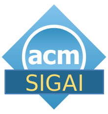

    The fifth ACM Conference on Equity and Access in Algorithms, Mechanisms, and Optimization (EAAMO'25) will be held from <b>November 5–7, 2025</b> in University of Pittsburgh, Pittsburgh, PA, USA.

  

    
  

  

<add-to-calendar-button 
  name="ACM EAAMO'25"
  description="The fifth ACM Conference on Equity and Access in Algorithms, Mechanisms, and Optimization (EAAMO'25) will be held from November 5–7, 2025 in University of Pittsburgh, Pittsburgh, PA, USA."
  startDate="2025-11-05"
  startTime="09:00"
  endDate="2025-11-07"
  endTime="18:00"
  timeZone="EST"
  location="https://conference.eaamo.org/"
  options="'Apple','Google','iCal','Outlook.com','Yahoo'"
></add-to-calendar-button>

- - -

## News:
- Early bird registration deadline is postponed to October 17!
- **Information about the poster and DC sessions:** The poster dimension should be 24 x 36 inches (60.96 x 91.44 cm).
- Preliminary schedule is out! Check out the program [here](conference_information/schedule/). 
- The registration for ACM EAAMO '25 is now live! Details can be found [here](registration).
- Download our [one-pager](EAAMO'25_Conference_Flyer.pdf) to quickly learn about the conference and help spread the word!

<!-- - Now Open: [Call for Posters](cfp/call_for_posters/) for ACM EAAMO '25 - **Submit by August 5**!
- Apply Now: [Doctoral Consortium](cfp/call_for_doctoral_consortium/) at ACM EAAMO '25 - Connect, Present, and Learn with Peers and Mentors in Equity and Algorithmic Research. **Deadline July 25, 2025**. 
- Accepted papers for ACM EAAMO'25 are now [available on the website](conference_information/accepted_papers).
- Financial assistance applications for ACM EAAMO'25 are now open. [Apply now](financial_assistance).
-->
- - -

<!-- - The host institution of ACM EAAMO'25 will be [Responsible Data Science](https://www.datascience.pitt.edu/) at University of Pittsburgh. -->
<!-- - We’re pleased to announce that the abstract and full paper submission deadlines have each been extended by one week to give authors more time to prepare their work. Please visit the [Call for Papers](/cfp) page for full details and submission guidelines.
- The paper submission page is now live—please visit the [Call for Papers](/cfp) page for full details and submission guidelines. -->
<!-- - **Call for Participation is now live!** Check out the details and submission guidelines for EAAMO '25 [here](/cfp) and submit your work by April 24, 2025. -->

<!-- 

    We invite researchers and practitioners to submit their papers by <b>April 17, 2025 (AoE)</b>.

 -->

## About ACM EAAMO Conference

The conference aims to highlight work that advances our understanding of the societal embedding of technology and how techniques from algorithms, optimization, and mechanism design, along with insights from the social sciences and humanistic studies, can help improve equity and access to opportunity for underserved communities. The conference will provide an inter-disciplinary forum for presenting research papers, problem pitches, survey and position papers, new datasets, and software demonstrations towards the goal of bridging research and practice.

 - - -

 ## Sponsors

    
    
    

