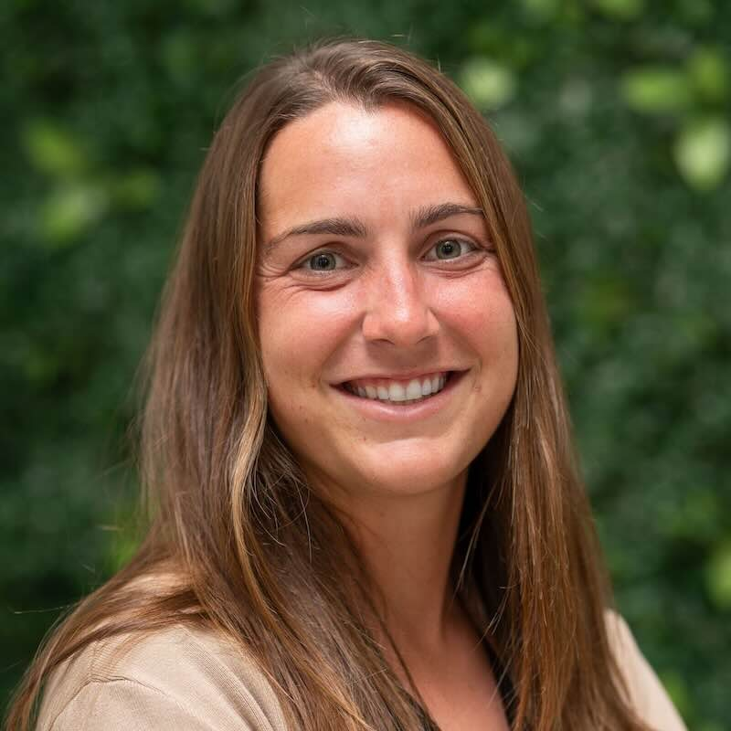

<!-- Event name: EAAMO’25 Local | Town -->

**Date:** 6 November 2025
**Location:** AIMS, Muizenberg, Cape Town
<iframe src="https://www.google.com/maps/embed?pb=!1m18!1m12!1m3!1d3303.529266574659!2d18.470592399999997!3d-34.10719770000001!2m3!1f0!2f0!3f0!3m2!1i1024!2i768!4f13.1!3m3!1m2!1s0x1dcc40541fb7b081%3A0x255bd0d6f3bf3663!2sAIMS!5e0!3m2!1sen!2srs!4v1757928787050!5m2!1sen!2srs" width="600" height="450" style="border:0;" allowfullscreen="" loading="lazy" referrerpolicy="no-referrer-when-downgrade"></iframe>

---

## About
EAAMO '25 | CAPE TOWN Local will bring together Cape Town–based researchers and students who share an interest in the EAAMO mission of building a research community that places the perspectives and interests of marginalized groups at the foundation of algorithmic and resource allocation systems.

The event will be held alongside the fifth *ACM Conference on Equity and Access in Algorithms, Mechanisms, and Optimization (EAAMO'25)* at the University of Pittsburgh, USA.

In addition to invited talks, participants will have opportunities to connect with attendees at the main EAAMO conference in Pittsburgh and the local event in Oxford.

## Register your interest

If you would you like to attend the Cape Town local event, please complete [this form](https://forms.gle/Uh9GNJQaBgfGSJEZ9). 

## Invited keynote speakers

### [Emily Aiken](https://emilylaiken.github.io/)

  

Emily is a postdoctoral scholar at Carnegie Mellon University Africa and an incoming assistant professor of data science and public policy at the University of California, San Diego (starting in 2026). Emily's research lies at the intersection of data science and development economics, primarily studying the application of novel algorithms and digital data sources for social protection and humanitarian aid programs. Emily holds a PhD in information science and an MS in computer science from UC Berkeley, and a BA in computer science from Harvard University.

### [Fazlyn Petersen](https://sites.google.com/uwc.ac.za/fazlyn-portfolio/home?authuser=0)

  

Dr Fazlyn Petersen has worked in various industries and professions for ten years, applying her theoretical knowledge to practical applications. Her use of human-centred design allows for collaboration with users to lead the design process for creating IT solutions. Her work focuses on ICT for Sustainable Community Development and Innovation. Her fusion of user-centric ethos and dedication to transformative change showcases a pathway where innovation intertwines with community empowerment.

---

## Acknowledgements
We are grateful for the support from:

