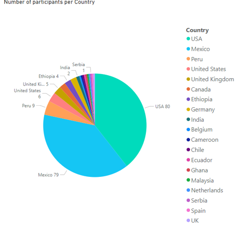

### General Overview

The fourth Association for Computing Machinery (ACM) conference on Equity and Access in Algorithms, Mechanisms, and Optimization ([ACM EAAMO ‘24](https://conference2024.eaamo.org/)) took place from October 29 to October 31, 2024, at the Autonomous University of San Luis Potosí (UASLP) in San Luis Potosí, Mexico. This year’s conference brought together a global community of scholars, practitioners, and students to explore how computational tools, economic theories, and mechanism design can improve access to opportunity for historically underserved and disadvantaged communities. The conference emphasized interdisciplinary contributions rooted in the social sciences and humanistic studies, reinforcing its commitment to inclusive and equitable research practices.

ACM EAAMO ‘24 drew participants from 19 countries, showcasing the event’s growing international reach. The largest groups comed from the United States (80 participants), Mexico (79 participants), and Peru (9 participants). In addition, researchers from Europe, Africa, and Asia joined the conference. The majority of attendees (151) traveled to San Luis Potosí for the in-person event, while 52 participated virtually.

    

**Sponsors**

The success of ACM EAAMO ‘24 was made possible by the generous support of many sponsoring organizations. We are especially grateful to:
ACM SIGecom and SIGAI
- Consejo Potosino de Ciencia y Tecnología (COPOCYT)
- Harvard David Rockefeller Center for Latin American Studies (DRCLAS)
- University Center for International Studies (UCIS) & Responsible Data Science (RDS), University of Pittsburgh
- Santander Universia
- Artificial Intelligence Journal
- Columbia University
- Economachina
- Harvard SEAS Office for Diversity, Inclusion, and Belonging
- REDNACECYT
- San Luis Potosí Municipal and State Government
- Autonomous University of San Luis Potosí (UASLP)
- San Luis Potosí Institute of Scientific Research and Technology (IPICYT)

Thanks to their collective support, ACM EAAMO ‘24 was able to uphold its commitment to equitable participation and expand access for underrepresented communities.

### Conference Highlights
The conference featured a dynamic and well-rounded program. Two distinguished keynote speakers provided insightful addresses:
- [Alessandra Fogli](https://sites.google.com/site/alessandrafoglisite/), Monetary Advisor and Assistant Director at the Federal Reserve Bank of Minneapolis, delivered a talk at the intersection of economics and social impact.
- [Irene Lo](https://sites.google.com/view/irene-lo), Assistant Professor at Stanford University, discussed the implications of algorithmic design and fairness in policy-making contexts.

    

ACM EAAMO ‘24 also included a **[Doctoral Consortium](https://conference2024.eaamo.org/cfp/doctoral-consortium/)**, which provided an essential space for emerging scholars to present their work, receive feedback, and connect with mentors and peers. In addition, the conference hosted a **[Panel Discussion](https://conference2024.eaamo.org/jpal/)**, organized in partnership with the Abdul Latif Jameel Poverty Action Lab (JPAL), bringing together academics and policymakers to bridge the gap between research and implementation.

Another notable highlight is the **[EAAMO Bridges](https://bridges.eaamo.org/)** session that focused on presenting working group of academics and practitioners that discusses strategies to design algorithmic systems and allocation methods that center the lived experiences and interests of marginalized groups

    

One of the most unique elements of ACM EAAMO ‘24 was the [**Social Hackathon**](https://conference2024.eaamo.org/social_hackathon/), a hands-on challenge focused on breast cancer disparities in Mexico. Participants collaborated across disciplines to develop evidence-based solutions that address inequities in healthcare access, environmental exposure, and early detection. This initiative demonstrated the power of collective action to tackle pressing societal issues.

We are especially proud to highlight the [**Summer of Science Program**](https://www.eaamo.org/projects/rednacecyt-2024-summer-of-science-program), in which 29 Indigenous women from across Mexico conducted and presented community-centered research projects. Their work addressed themes such as environmental preservation, health equity, and education in Indigenous languages. This initiative amplified underrepresented voices and reaffirmed the importance of diversity in scientific research.

### Program Participation

ACM EAAMO '24 program attracted 113 research submissions. Following a rigorous peer-review process, 26 papers were accepted and presented during the conference. The program also featured 16 poster presentations, including seven by Indigenous students from the Peruvian Summer of Science program, further showcasing the conference's international and inclusive spirit. From the accepted papers, 13 were accepted in the fourth volume of the archival track of the conference: [the Proceedings of EAAMO ‘24: Equity and Access in Algorithms, Mechanisms, and Optimization](https://dl.acm.org/doi/proceedings/10.1145/3689904) published by the ACM.

Each of the three days of the conference featured either keynote talks or panel discussions alongside thematically related sessions. Our keynote talks addressed key themes for the conference: mechanisms, optimization, and policy. The themed  multi-disciplinary sessions for contributed talks represented a wide range of topics and application domains of interest to the conference goals, the combination of novel and diverse methodologies, as well as the strong connections of many papers to policy design: Participation, Allocation under constraints, Government Regulation & Audits, Quantitative social science and conceptual frameworks, Service Delivery & Incentives, Algorithms for Allocation, Computational Social Choice, Algorithmic Fairness and Documentation, Policy & Practice, Human Factors, and Allocation in Social Services.

Financial accessibility remained a priority, with over $32,000 allocated in travel grants and registration waivers. These funds supported the participation of more than 50 individuals, particularly students and attendees from the Global South.

In total, 203 individuals participated in EAAMO ‘24, with attendees joining both in person and virtually. The conference's ability to draw such a diverse and engaged audience is a testament to its relevance, resonance, and global mission.

- - -

### Social Hackathon: Breast Cancer in Mexico

The [**ACM EAAMO ‘24 Social Hackathon**](https://conference2024.eaamo.org/social_hackathon/) provided a unique opportunity for participants to engage in applied problem-solving related to one of Mexico’s most pressing public health issues: breast cancer. With 31 individuals expressing interest and forming teams across continents, the hackathon encouraged innovative solutions to complex challenges related to early detection, patient support, healthcare access, and environmental exposure.

- Winning Team - Sana (Harvard University): Developed a mobile and web-based platform that combines real-time environmental data with machine learning models to provide personalized risk assessments for breast cancer. Their solution targeted both individuals and policymakers to enhance awareness and guide interventions.
- Runner-Up - ALMA (Harvard University): Proposed a data-driven approach to categorizing breast cancer risk using environmental, demographic, and healthcare access data. Their solution aimed to inform public health strategies with high model accuracy.
- Third Place - Parallelized System (Mexican students): Focused on building a centralized AI-powered diagnostic system using labeled mammogram datasets. They also introduced a Breast Cancer Risk Index to guide regional interventions.
- Honorable Mention - Shobhit Jagga (Quadeye): Presented a contribution-based budget allocation model for optimizing breast cancer mortality reduction. His solution integrated ethical safeguards, predictive modeling, and interactive tools for policy makers.

    

Partners in this initiative included the Mobile Health Center at IPICYT, UASLP, and COPOCYT. Together, these institutions helped foster innovation, support data integration, and ensure local relevance and impact.

### Indigenous Collaboration: Summer of Science Program

The 2024 [**Summer of Science Program**](https://www.eaamo.org/projects/rednacecyt-2024-summer-of-science-program) was a landmark initiative in collaboration with REDNACECYT, designed to empower Indigenous women students from across Mexico. A total of 29 students participated, representing regions such as Michoacán, San Luis Potosí, Chihuahua, Puebla, and Oaxaca. These students come from Indigenous communities including the Purépecha, Tének, Rarámuri, and Náhuatl, bringing with them diverse cultural backgrounds and a shared commitment to positive change.

Their projects focused on local issues such as environmental conservation, community health, and education in Indigenous languages. The program provided mentorship and resources to support students in developing impactful, research-driven solutions. In addition to this cohort, seven Indigenous students from the Amazon region of Peru also presented posters as part of the program, highlighting cross-border collaboration.

    

### Acknowledgements

We extend our deepest appreciation to all those who made ACM EAAMO ‘24 possible. This includes the authors and presenters whose work shaped the intellectual content of the conference, the reviewers and area chairs who ensured the quality of the submissions, the program and executive committees for their guidance, and the general chair for overseeing the event’s inclusive execution.

We look forward to welcoming you to ACM EAAMO ‘25 and to continuing our shared mission of advancing equity and access in algorithms, mechanisms, and optimization.