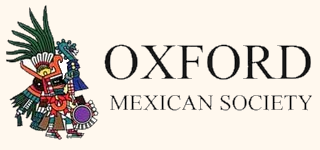

<!-- Event name: EAAMO’25 Local | Oxford -->

**Date:** 5–7 November 2025  \
**Location:** [Linacre College, Oxford](https://maps.google.com/?q=Linacre+College,+Oxford)
<iframe src="https://www.google.com/maps/embed?pb=!1m18!1m12!1m3!1d2469.5628904471187!2d-1.2525140233648229!3d51.75931607187166!2m3!1f0!2f0!3f0!3m2!1i1024!2i768!4f13.1!3m3!1m2!1s0x4876c6aa4500f56f%3A0xc2613c4327b3d38e!2sLinacre%20College!5e0!3m2!1sen!2srs!4v1757247329772!5m2!1sen!2srs" width="600" height="450" style="border:0;" allowfullscreen="" loading="lazy" referrerpolicy="no-referrer-when-downgrade"></iframe>

**Contact:** [oxfordlocal@eaamo.org](mailto:oxfordlocal@eaamo.org)

---

## About
EAAMO ’25 | OXFORD Local brings together researchers from computer science, economics, and the wider social sciences to tackle issues around social good. We believe now is a pivotal moment to reflect on how these disciplines can come together—not least to assess the risks, as well as the opportunities, that AI (and digitisation) brings to this space.

The event will be held alongside the fifth **ACM Conference on Equity and Access in Algorithms, Mechanisms, and Optimization (EAAMO'25)** at the University of Pittsburgh, USA.

As part of the **EAAMO‑REDNACECYT Summer of Science 2025**, our event will also host indigenous researchers from Latin America. In addition to presenting their work in Oxford, they will also take part in a series of seminars, workshops, and activities in an event in London (3–4 November).

---

## Registration
Please register by **19 October** to help us plan the event. Registration is free.

<a href="https://forms.gle/x7BYQamUMpQ3wKAd8" target="_blank" rel="noopener" style="display:inline-block;padding:10px 16px;border-radius:8px;border:1px solid #111;text-decoration:none;font-weight:600;">Register for EAAMO’25 Local | Oxford</a>

---

## Important dates
- **Early bird submissions** by 26 September AoE will be **notified** by 30 September AoE.
- **Submission deadline:** 9 October AoE.
- **Submission notification:** 12 October AoE.
- **Registration deadline:** 19 October AoE.

If you are a late bird, email us at [oxfordlocal@eaamo.org](mailto:oxfordlocal@eaamo.org).

Submissions will be considered on a rolling basis.

---

## Call for Submissions
All submissions are non-archival. Accepted submissions will be invited to give a contributed talk.

We invite submissions that advance access to opportunity for historically underserved and disadvantaged communities while addressing inequitable or unsafe outcomes.

We accept submissions that are being presented at EAAMO’25 or have been published/presented elsewhere.

<a href="https://forms.gle/PquKuUvTLNJQUuQNA" target="_blank" rel="noopener" style="display:inline-block;margin-top:6px;padding:10px 16px;border-radius:8px;border:1px solid #111;text-decoration:none;font-weight:600;">Submit your work</a>

### Topics of interest include
- Machine learning, optimization, and mechanism design approaches to reducing social and economic inefficiencies and unsafe outcomes
- Ethical, economic, legal, philosophical, and societal considerations of algorithmically driven systems
- Redistributive mechanisms aimed at improving access and achieving equitable outcomes
- Micro‑ and macroeconomic impacts of inequality and market inefficiencies
- Causal factors of harm, such as exploitative or biased behaviors, market failures, and overall inequities
- Uncertainty, safety, privacy, and fairness in allocation and representation systems
- Algorithmic and societal challenges in resource‑constrained computing environments
- Trustworthy and valid inference in socially consequential domains
- Data governance: collection, curation, protection, sharing, and transparency for research on access and equity
- Community empowerment tools: algorithmic methods that encourage participation and collective action for the common good
- Policy and regulatory design related to data, privacy, fairness, equity, and access to opportunity

**Application domains of interest include (among others):** civic participation, data economies, discrimination and bias, digital/economic inequalities, economic development, education, environment & climate, food security, healthcare, housing, infrastructure, labor markets, law & policy, low‑ and under‑resourced computing, social and economic mobility, privacy, public services, recommender systems, social work, sustainable development, and transportation.

### Submission types may include
- Research papers  
- Surveys  
- Position papers  
- Problem‑ or practice‑driven contributions  
- Workshops (1h)

We welcome work from academics and practitioners across diverse disciplines and sectors. The reviewing process will be **single‑blind** and **single phase** (without rebuttal). The reviewers will also choose a **prize winner** among all submissions.

<a href="https://forms.gle/PquKuUvTLNJQUuQNA" target="_blank" rel="noopener" style="display:inline-block;margin-top:6px;padding:10px 16px;border-radius:8px;border:1px solid #111;text-decoration:none;font-weight:600;">Submit your work</a>

---

## Invited Keynote Speakers

<table>
  <tr>
    <td style="vertical-align:top;width:33%;">
      
      
<strong>Maximilian (Max) Kasy</strong> — University of Oxford

      
<a href="https://maxkasy.github.io/home/" target="_blank" rel="noopener">Website</a>

    </td>
    <td style="vertical-align:top;width:33%;">
      
      
<strong>Ingmar Weber</strong> — Saarland University

      
<a href="https://ingmarweber.de/" target="_blank" rel="noopener">Website</a>

    </td>
    <!-- <td style="vertical-align:top;width:33%;">
      
      
<strong>Aída García Lázaro</strong> — University of Bath

      
<a href="https://researchportal.bath.ac.uk/en/persons/aida-garcia-lazaro" target="_blank" rel="noopener">Website</a>

    </td> -->
  </tr>
  <tr>
    <td style="vertical-align:top;width:33%;">
      
      
<strong>Esther Gehrke</strong> — Wageningen University

      
<a href="https://www.esthergehrke.com/" target="_blank" rel="noopener">Website</a>

    </td>
    <td style="vertical-align:top;width:33%;">
      
      
<strong>Christian Meyer</strong> — University of Oxford

      
<a href="https://www.chrmeyer.com/pages/about/" target="_blank" rel="noopener">Website</a>

    </td>
  </tr>
</table>

---

## Preliminary schedule

<a href="EAAMO'25 _ Oxford Local (Preliminary Schedule).pdf" target="_blank" rel="noopener" style="display:inline-block;margin-top:6px;padding:10px 16px;border-radius:8px;border:1px solid #111;text-decoration:none;font-weight:600;">Download the preliminary schedule</a>

<!-- ### Day 1 — Wednesday, 05 November 2025
**Keynote Speaker:** To be confirmed  
**Session Topics:** Topics day 1

- 09:00–09:30 — Arrival and Registration / Morning Coffee  
- 09:30–10:30 — Keynote Lecture: To be confirmed  
- 10:30–12:00 — Paper Presentations (Topic 1, day 1)  
- 12:00–14:30 — Lunch Break and City Walk  
- 14:30–15:30 — Plenary talk (Pittsburgh Online Talk, day 1)  
- 15:30–17:00 — Paper Presentations (Topic 2, day 1)  
- 17:30–19:00 — Poster Session 1 (Summer of Science participants)
- 19:00–20:30 — Dinner

### Day 2 — Thursday, 06 November 2025
**Keynote Speaker:** Maximilian Kasy (University of Oxford)  
**Session Topics:** Topics day 2

- 09:30–10:30 — Keynote Lecture: Maximilian Kasy (Professor of Economics, University of Oxford)  
- 10:30–12:00 — Paper Presentations (Topic 1, day 2)  
- 12:00–14:30 — Lunch Break and City Walk  
- 14:30–15:30 — Plenary talk (Pittsburgh Online Talk, day 2)  
- 15:30–17:00 — Paper Presentations (Topic 2, day 2)  
- 17:30–19:00 — Poster Session 2 (Summer of Science participants)
- 19:00–20:30 — Dinner

### Day 3 — Friday, 07 November 2025
**Keynote Speaker:** Ingmar Weber (Saarland University)  
**Session Topics:** Topics day 3

- 10:30–12:00 — Paper Presentations (Topic 1, day 3)  
- 12:00–14:30 — Lunch Break and City Walk  
- 14:30–15:30 — Keynote Lecture: Ingmar Weber (Saarland University)  
- 15:30–17:00 — Paper Presentations (Topic 2, day 3)  
- 17:30–19:00 — Conference Social 
- 19:00–20:30 — Dinner -->

---

## Organisers
- [Edwin Lock](https://edwinlock.com)
- [Michelle González Amador](https://www.m-gonzalezamador.com/)
- [Rubén Martínez Cárdenas](https://rubenmtzc.netlify.app/)

---

## Acknowledgements
We are grateful for the support from:

</a>

